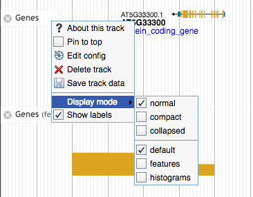

#Sequence Views Plugin
This is a JBrowse plugin
 
This plugin allowst the user to manually switch between feature/read views and histogram views. Normally, the switch between view styles depends on the zoom level, which can be frustrating.

##Install

For JBrowse 1.11.6+ in the _JBrowse/plugins_ folder, type:  
``git clone https://github.com/bhofmei/jbplugin-seqview.git SeqViewsPlugin``

downloaded the latest release version at [releases](https://github.com/bhofmei/jbplugin-seqview/releases).  
Unzip the downloaded folder, place in _JBrowse/plugins_, and rename the folder _SeqViewsPlugin_

##Activate
Add this to _jbrowse.conf_ under `[GENERAL]`:

    [ plugins.SeqViewsPlugin ]
    location = plugins/SeqViewsPlugin

If that doesn't work, add this to *jbrowse_conf.json*:

    "plugins" : {
        "SeqViewsPlugin" : { "location" : "plugins/SeqViewsPlugin" }
    }
    
## Test
Sample data is included in the plugin to test that the plugin is working properly. With `URL` as the URL path to the JBrowse instance, navigate a web browser to `URL/index.html?data=plugins/SeqViewsPlugin/sample_data`.

## Use
For all track types that are derived from ``CanvasFeatures`` tracks, i.e. Alignments2, CanvasFeatures, smAlginments, have additional options in the *Display Mode* menu for each track.

* **Default**: switch between features/histograms based on zoom as it normally would
* **Features**: force track to show features/alignments; once zoomed out too far, it gives a warning to zoom in
* **Histograms**: force tack to show histogram/coverage view
    * Alignment-like tracks: if no underlying bigwig file with coverage information, gives user a warning
    * Features-like tracks: always computes histograms
    

This is especially useful for high density RNA-seq tracks when the switch between features and histograms occurs at an incovienent zoom level.